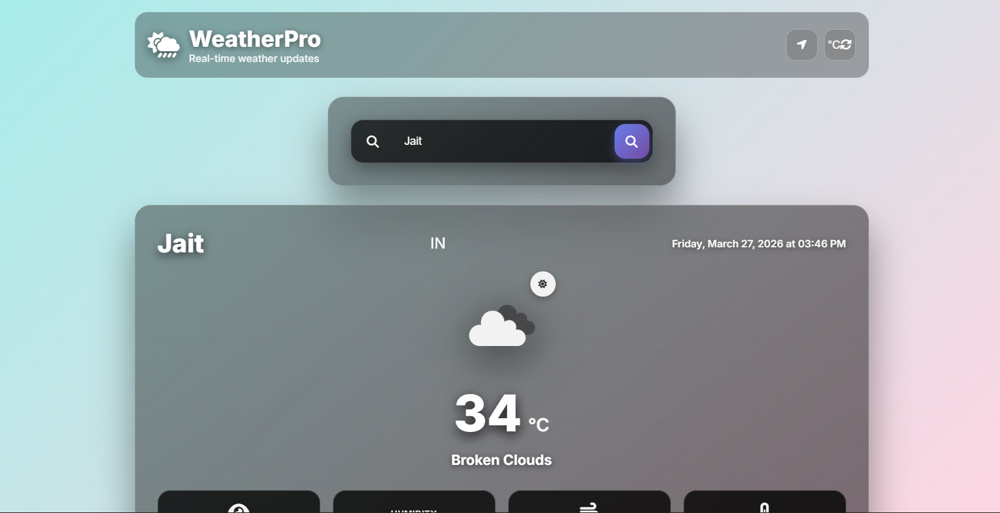

# Weather App 

This is a simple weather app made using HTML, CSS and JavaScript.

It shows real-time weather information using the OpenWeather API.

Features
- Search weather by city
- Shows temperature
- Shows humidity
- Shows weather condition

Technologies Used
- HTML
- CSS
- JavaScript
- OpenWeather API